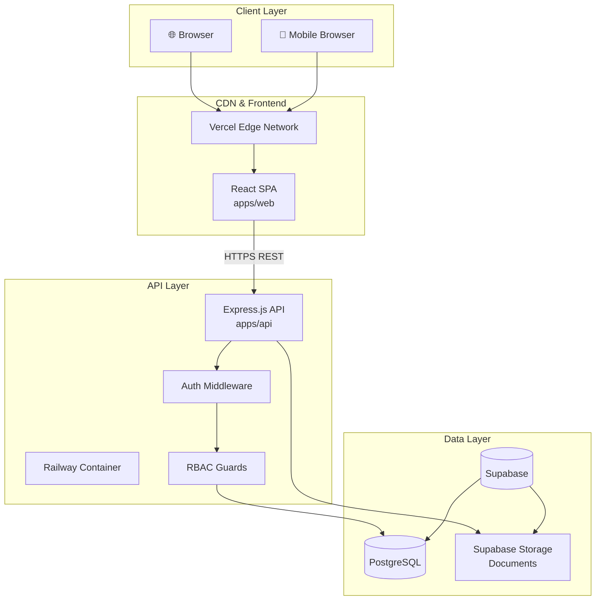

# 2. High Level Architecture

## 2.1 Technical Summary

L'architecture de la Plateforme ONG Chadia suit un modèle **monolithe modulaire** déployé sur une infrastructure cloud 100% gratuite. Le frontend React SPA communique avec une API REST Express.js via HTTPS. L'authentification utilise JWT avec refresh tokens. Les données sont stockées dans PostgreSQL (Supabase) et les fichiers dans Supabase Storage (S3-compatible). Cette architecture privilégie la simplicité et la rapidité de développement pour un MVP en 4 semaines, tout en restant évolutive vers des microservices si nécessaire.

## 2.2 Platform and Infrastructure Choice

**Analyse des options:**

| Option | Pros | Cons |
|--------|------|------|
| **Vercel + Supabase** ✅ | Gratuit, DX excellente, intégration native, auth/storage inclus | Limites tier gratuit, vendor lock-in |
| **AWS Full Stack** | Scalabilité illimitée, services complets | Complexe, coûts imprévisibles, overkill pour MVP |
| **Railway + Supabase** | Simple, gratuit 500h/mois, PostgreSQL inclus | Limites compute, cold starts |

**Choix retenu: Vercel (Frontend) + Railway (Backend) + Supabase (DB/Storage)**

- **Platform:** Multi-cloud (Vercel + Railway + Supabase)
- **Key Services:**
  - Vercel Edge Network (frontend hosting, CDN)
  - Railway (Node.js backend hosting)
  - Supabase PostgreSQL (database)
  - Supabase Storage (file storage, S3-compatible)
- **Deployment Regions:** Europe (Frankfurt) - proche du Tchad

## 2.3 Repository Structure

- **Structure:** Monorepo
- **Monorepo Tool:** pnpm workspaces (natif, léger, performant)
- **Package Organization:**
  - `apps/web` - Frontend React
  - `apps/api` - Backend Express
  - `packages/shared` - Types TypeScript, constantes, utilitaires partagés

## 2.4 High Level Architecture Diagram

## 2.5 Architectural Patterns

- **Monolith Modulaire:** Backend organisé en modules (auth, documents, projects, dashboard) - _Rationale:_ Simplicité pour MVP, un seul déploiement, facile à maintenir par un développeur solo

- **REST API:** Endpoints RESTful avec JSON - _Rationale:_ Standard, bien compris, compatible avec tous les clients, debugging facile

- **Repository Pattern:** Couche d'abstraction Prisma entre services et DB - _Rationale:_ Testabilité, possibilité de changer de DB sans refonte

- **Component-Based UI:** Composants React réutilisables avec TypeScript - _Rationale:_ Maintenabilité, type safety, écosystème shadcn/ui

- **JWT Authentication:** Access + Refresh tokens - _Rationale:_ Stateless, scalable, standard industrie

- **RBAC (Role-Based Access Control):** 4 niveaux de permissions - _Rationale:_ Requis par PRD, sécurité granulaire documents sensibles

---
