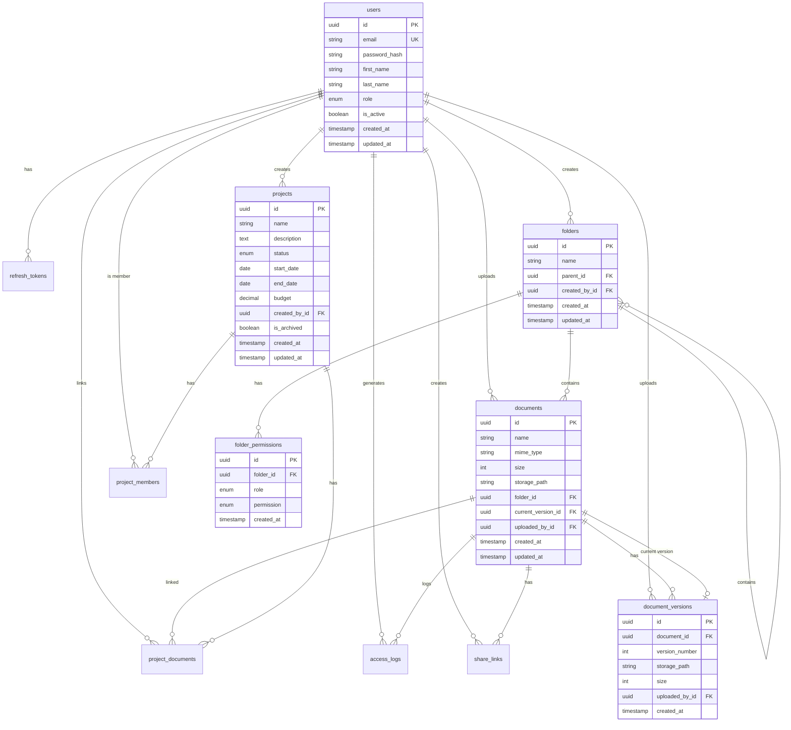

# 4. Data Models

Définition des entités métier principales partagées entre frontend et backend.

## 4.1 User

**Purpose:** Représente un utilisateur de la plateforme avec son niveau d'accès.

**Key Attributes:**
- `id`: string (UUID) - Identifiant unique
- `email`: string - Email unique, utilisé pour login
- `passwordHash`: string - Hash bcrypt du mot de passe
- `firstName`: string - Prénom
- `lastName`: string - Nom
- `role`: Role - Niveau d'accès (SUPER_ADMIN, STAFF, CONTRIBUTOR, GUEST)
- `isActive`: boolean - Compte actif ou désactivé
- `createdAt`: DateTime - Date de création
- `updatedAt`: DateTime - Dernière modification

```typescript
// packages/shared/src/types/user.ts

export enum Role {
  SUPER_ADMIN = 'SUPER_ADMIN',
  STAFF = 'STAFF',
  CONTRIBUTOR = 'CONTRIBUTOR',
  GUEST = 'GUEST'
}

export interface User {
  id: string;
  email: string;
  firstName: string;
  lastName: string;
  role: Role;
  isActive: boolean;
  createdAt: Date;
  updatedAt: Date;
}

// Version sans données sensibles pour le frontend
export type UserPublic = Omit<User, 'passwordHash'>;
```

**Relationships:**
- Un User peut créer plusieurs Folders
- Un User peut uploader plusieurs Documents
- Un User peut être membre de plusieurs Projects

## 4.2 Folder

**Purpose:** Dossier pour organiser les documents en hiérarchie.

```typescript
// packages/shared/src/types/folder.ts

export interface Folder {
  id: string;
  name: string;
  parentId: string | null;
  createdById: string;
  createdAt: Date;
  updatedAt: Date;
}

export interface FolderWithChildren extends Folder {
  children: Folder[];
  documents: Document[];
  permissions: FolderPermission[];
}

export interface FolderTreeNode {
  id: string;
  name: string;
  children: FolderTreeNode[];
  hasAccess: boolean;
}
```

**Relationships:**
- Un Folder peut avoir un parent Folder (auto-référence)
- Un Folder peut contenir plusieurs Documents
- Un Folder a plusieurs FolderPermissions

## 4.3 FolderPermission

**Purpose:** Définit les droits d'accès par rôle sur un dossier.

```typescript
// packages/shared/src/types/permission.ts

export enum Permission {
  READ = 'READ',     // Voir et télécharger
  WRITE = 'WRITE',   // READ + upload, modifier, supprimer
  ADMIN = 'ADMIN'    // WRITE + gérer permissions
}

export interface FolderPermission {
  id: string;
  folderId: string;
  role: Role;
  permission: Permission;
}

// Helper pour vérifier les permissions
export const hasPermission = (
  userRole: Role,
  required: Permission,
  folderPermissions: FolderPermission[]
): boolean => {
  // SUPER_ADMIN a toujours accès
  if (userRole === Role.SUPER_ADMIN) return true;

  const userPerm = folderPermissions.find(p => p.role === userRole);
  if (!userPerm) return false;

  const levels = { READ: 1, WRITE: 2, ADMIN: 3 };
  return levels[userPerm.permission] >= levels[required];
};
```

## 4.4 Document

**Purpose:** Fichier uploadé dans la GED.

```typescript
// packages/shared/src/types/document.ts

export interface Document {
  id: string;
  name: string;
  mimeType: string;
  size: number;
  storagePath: string;
  folderId: string;
  currentVersionId: string | null;
  uploadedById: string;
  createdAt: Date;
  updatedAt: Date;
}

export interface DocumentWithDetails extends Document {
  folder: Folder;
  uploadedBy: UserPublic;
  versions: DocumentVersion[];
  currentVersion: DocumentVersion | null;
}

// Types MIME acceptés
export const ALLOWED_MIME_TYPES = [
  'application/pdf',
  'application/msword',
  'application/vnd.openxmlformats-officedocument.wordprocessingml.document',
  'application/vnd.ms-excel',
  'application/vnd.openxmlformats-officedocument.spreadsheetml.sheet',
  'image/jpeg',
  'image/png',
  'image/gif',
  'text/plain'
] as const;

export const MAX_FILE_SIZE = 50 * 1024 * 1024; // 50 MB
```

## 4.5 DocumentVersion

**Purpose:** Historique des versions d'un document.

```typescript
export interface DocumentVersion {
  id: string;
  documentId: string;
  versionNumber: number;
  storagePath: string;
  size: number;
  uploadedById: string;
  createdAt: Date;
}
```

## 4.6 ShareLink

**Purpose:** Lien de partage temporaire pour accès externe.

```typescript
// packages/shared/src/types/share.ts

export interface ShareLink {
  id: string;
  documentId: string;
  token: string;
  expiresAt: Date;
  createdById: string;
  accessCount: number;
  createdAt: Date;
}

export type ShareDuration = '1h' | '24h' | '7d' | '30d';
```

## 4.7 AccessLog

**Purpose:** Journal d'audit des accès aux documents.

```typescript
// packages/shared/src/types/audit.ts

export enum AccessAction {
  VIEW = 'VIEW',
  DOWNLOAD = 'DOWNLOAD',
  UPLOAD = 'UPLOAD',
  EDIT = 'EDIT',
  DELETE = 'DELETE',
  SHARE = 'SHARE'
}

export interface AccessLog {
  id: string;
  documentId: string;
  userId: string | null;  // null pour accès via ShareLink
  action: AccessAction;
  ipAddress: string;
  userAgent: string;
  createdAt: Date;
}
```

## 4.8 Project

**Purpose:** Projet de l'ONG avec suivi d'avancement.

```typescript
// packages/shared/src/types/project.ts

export enum ProjectStatus {
  DRAFT = 'DRAFT',
  PREPARATION = 'PREPARATION',
  IN_PROGRESS = 'IN_PROGRESS',
  COMPLETED = 'COMPLETED',
  CANCELLED = 'CANCELLED'
}

export interface Project {
  id: string;
  name: string;
  description: string | null;
  status: ProjectStatus;
  startDate: Date | null;
  endDate: Date | null;
  budget: number | null;
  createdById: string;
  isArchived: boolean;
  createdAt: Date;
  updatedAt: Date;
}

export interface ProjectWithDetails extends Project {
  members: ProjectMemberWithUser[];
  documents: DocumentWithDetails[];
  createdBy: UserPublic;
}
```

## 4.9 ProjectMember

**Purpose:** Association utilisateur-projet avec rôle projet.

```typescript
export enum ProjectRole {
  PROJECT_MANAGER = 'PROJECT_MANAGER',
  MEMBER = 'MEMBER',
  VOLUNTEER = 'VOLUNTEER'
}

export interface ProjectMember {
  id: string;
  projectId: string;
  userId: string;
  role: ProjectRole;
  assignedAt: Date;
}

export interface ProjectMemberWithUser extends ProjectMember {
  user: UserPublic;
}
```

## 4.10 ProjectDocument

**Purpose:** Liaison entre projets et documents GED.

```typescript
export interface ProjectDocument {
  id: string;
  projectId: string;
  documentId: string;
  linkedById: string;
  linkedAt: Date;
}
```

## 4.11 Entity Relationship Diagram



---
