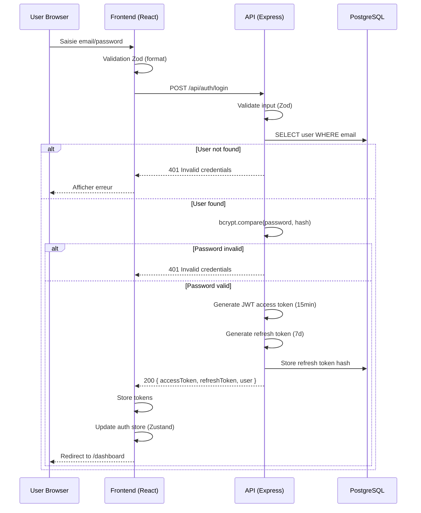
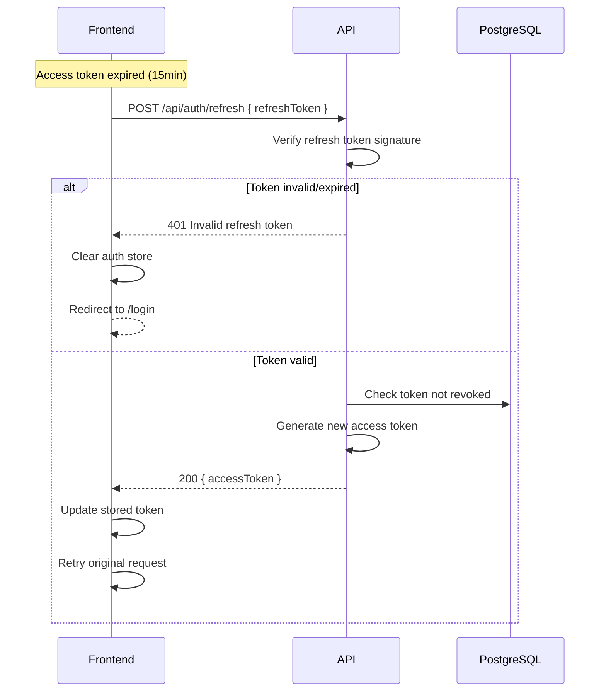
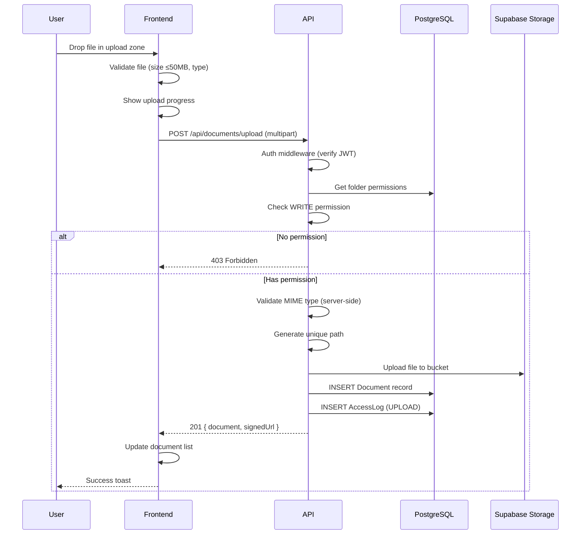
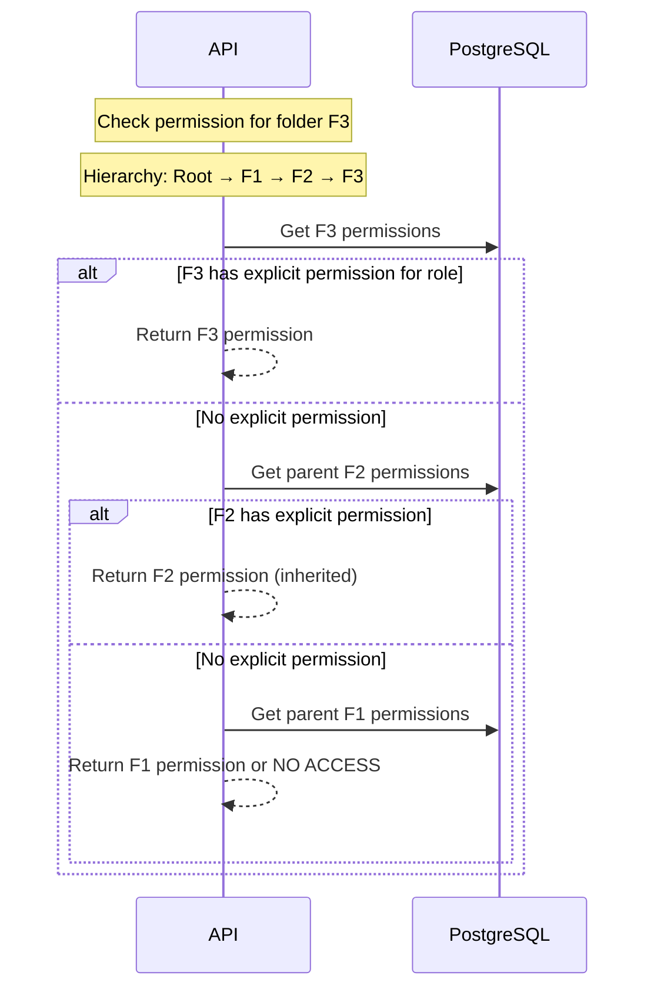
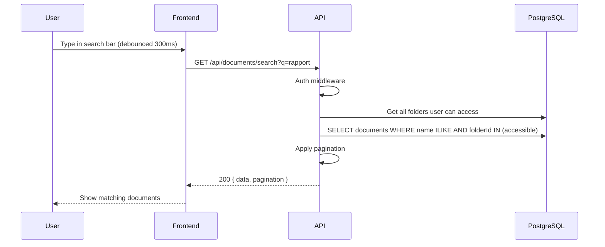

# 8. Core Workflows

## 8.1 Authentication Flow (Login)

```mermaid
sequenceDiagram
    participant U as User Browser
    participant F as Frontend (React)
    participant A as API (Express)
    participant DB as PostgreSQL

    U->>F: Saisie email/password
    F->>F: Validation Zod (format)
    F->>A: POST /api/auth/login
    A->>A: Validate input (Zod)
    A->>DB: SELECT user WHERE email

    alt User not found
        A-->>F: 401 Invalid credentials
        F-->>U: Afficher erreur
    else User found
        A->>A: bcrypt.compare(password, hash)
        alt Password invalid
            A-->>F: 401 Invalid credentials
        else Password valid
            A->>A: Generate JWT access token (15min)
            A->>A: Generate refresh token (7d)
            A->>DB: Store refresh token hash
            A-->>F: 200 { accessToken, refreshToken, user }
            F->>F: Store tokens
            F->>F: Update auth store (Zustand)
            F-->>U: Redirect to /dashboard
        end
    end
```

## 8.2 Token Refresh Flow

```mermaid
sequenceDiagram
    participant F as Frontend
    participant A as API
    participant DB as PostgreSQL

    Note over F: Access token expired (15min)
    F->>A: POST /api/auth/refresh { refreshToken }
    A->>A: Verify refresh token signature

    alt Token invalid/expired
        A-->>F: 401 Invalid refresh token
        F->>F: Clear auth store
        F-->>F: Redirect to /login
    else Token valid
        A->>DB: Check token not revoked
        A->>A: Generate new access token
        A-->>F: 200 { accessToken }
        F->>F: Update stored token
        F->>F: Retry original request
    end
```

## 8.3 Document Upload Flow

```mermaid
sequenceDiagram
    participant U as User
    participant F as Frontend
    participant A as API
    participant DB as PostgreSQL
    participant S as Supabase Storage

    U->>F: Drop file in upload zone
    F->>F: Validate file (size ≤50MB, type)
    F->>F: Show upload progress
    F->>A: POST /api/documents/upload (multipart)

    A->>A: Auth middleware (verify JWT)
    A->>DB: Get folder permissions
    A->>A: Check WRITE permission

    alt No permission
        A-->>F: 403 Forbidden
    else Has permission
        A->>A: Validate MIME type (server-side)
        A->>A: Generate unique path
        A->>S: Upload file to bucket
        A->>DB: INSERT Document record
        A->>DB: INSERT AccessLog (UPLOAD)
        A-->>F: 201 { document, signedUrl }
        F->>F: Update document list
        F-->>U: Success toast
    end
```

## 8.4 Folder Permission Inheritance

```mermaid
sequenceDiagram
    participant A as API
    participant DB as PostgreSQL

    Note over A: Check permission for folder F3
    Note over A: Hierarchy: Root → F1 → F2 → F3

    A->>DB: Get F3 permissions

    alt F3 has explicit permission for role
        A-->>A: Return F3 permission
    else No explicit permission
        A->>DB: Get parent F2 permissions

        alt F2 has explicit permission
            A-->>A: Return F2 permission (inherited)
        else No explicit permission
            A->>DB: Get parent F1 permissions
            A-->>A: Return F1 permission or NO ACCESS
        end
    end
```

## 8.5 Document Search Flow

```mermaid
sequenceDiagram
    participant U as User
    participant F as Frontend
    participant A as API
    participant DB as PostgreSQL

    U->>F: Type in search bar (debounced 300ms)
    F->>A: GET /api/documents/search?q=rapport

    A->>A: Auth middleware
    A->>DB: Get all folders user can access
    A->>DB: SELECT documents WHERE name ILIKE AND folderId IN (accessible)
    A->>A: Apply pagination
    A-->>F: 200 { data, pagination }
    F-->>U: Show matching documents
```

---
